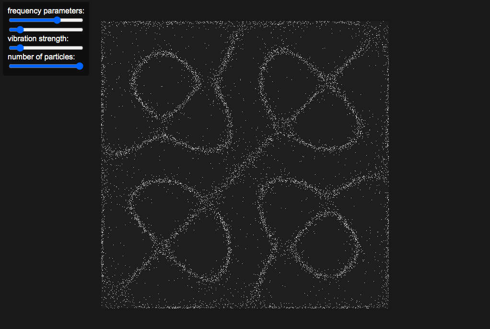

A small physics demonstration using p5.js.

**Chladni patterns** form when a speaker playing a set frequency is placed underneath a square plate covered with sand. You can see an example [here](https://www.youtube.com/watch?v=tFAcYruShow).

I used the derivation [here](https://thelig.ht/chladni/) for a closed-form solution to the wave equation. The derivation makes some simplifications, including setting the boundary conditions of the plate to 0 (when they'd actually be vibrating freely and described by some complex PDEs outlined on that page). For the sake of writing this code in a single evening, I chose not to delve much deeper.
